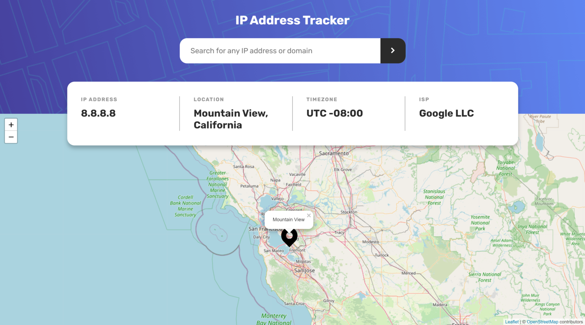

# 🚀🚀🚀

In this challenge I tried to modulate the code in search of presenting a clear code.

- How i can improve the legibility of my code 
- There's a small bug with the marker, when you move aways the zoom of the page this be desconfigurate and see bad. How i fix?
- Any advice for improve is welcome 🚀

## Preview

# Desktop design

# Mobile design

## Frontend Mentor - IP address tracker

